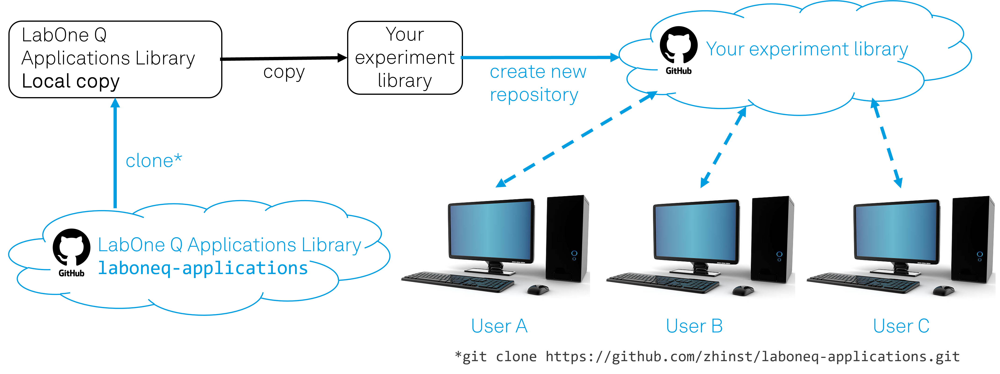

# Deployment

The LabOne Q Applications Library provides the application-specific content of LabOne Q: experiments, qubit and quantum processing unit (QPU) objects, quantum operations, and analysis routines. This content is meant to be used in one of two ways: run as it is for common characterization and tune-up tasks, or copied and adapted to match your own QPU and experiments. This page describes how we recommend you set the library up for the second case, so that a team can build on it and share the result. It is relevant if you plan to adapt the library's experiments or write your own on top of them; if you only run the experiments as they are, you can install the library as a package (see the [Installation](https://docs.zhinst.com/labone_q_user_manual/getting_started/installation.html) page) and do not need the setup described here.

*Figure 2: Recommended deployment of the LabOne Q Applications Library. The library is cloned from Zurich Instruments' `laboneq-applications` repository into a local copy, copied into your own experiment library, and published as a new repository from which each member of the team works.*

The Applications Library is published as an [open-source repository](https://github.com/zhinst/laboneq-applications) on GitHub, `laboneq-applications`. We recommend you follow these three steps to set up your own experiment library as a copy of our Applications Library:

- **Clone the `laboneq-applications` repository.** Cloning it (`git clone https://github.com/zhinst/laboneq-applications.git`) gives you a local copy of the full source, not only an installed package. You work with the source because it is what you read, run, and adapt.
- **Copy it into your own experiment library.** Copying the content into a separate experiment library, rather than editing the clone in place, keeps your work apart from Zurich Instruments' version, so that the two do not interfere and you stay free to change the code to suit your QPU and experiments.
- **Create a repository for your experiment library.** Publishing your experiment library as its own repository, on GitHub or another Git host, puts your team's code under version control and gives it a single, shared home.

Each member of the team then works from this shared repository, as shown for User A, User B, and User C in Figure 2: they clone it to their own computer and contribute their changes back. Setting the library up this way keeps your codebase organized and under version control, and it lets the team share experiments and adaptations instead of keeping them on individual computers.
